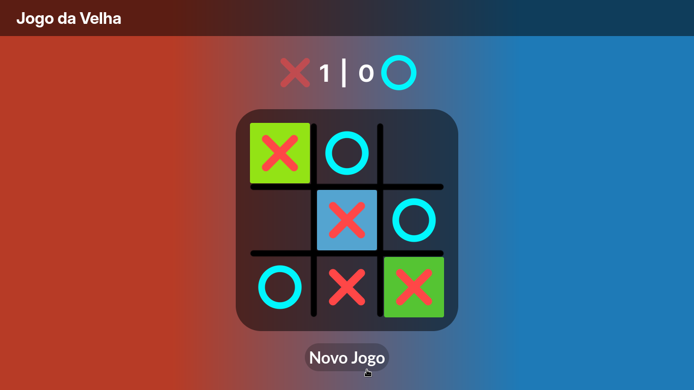

# Jogo da Velha
Um jogo da velha simples e elegante feito com HTML, CSS e JavaScript, feito como forma de aprendizado.

### Pré visualização:

### Ideias futuras:

##### Back-end:
 - Adicionar um modo multiplayer em LAN.
    Usando:
    1. Flask 
    2. Django
    3. NodeJS
- Adicionar IA para jogar.
    - Rede Neural
    - Busca em árvore
    - Algoritimos alternativos

##### Front-end
- Barra lateral
    - Configurações do multiplayer
    - Algoritimos de IA.
    - Configuração customizável da aparência.
        - Armazenadas no cache do navegador.
    - Mais estilos